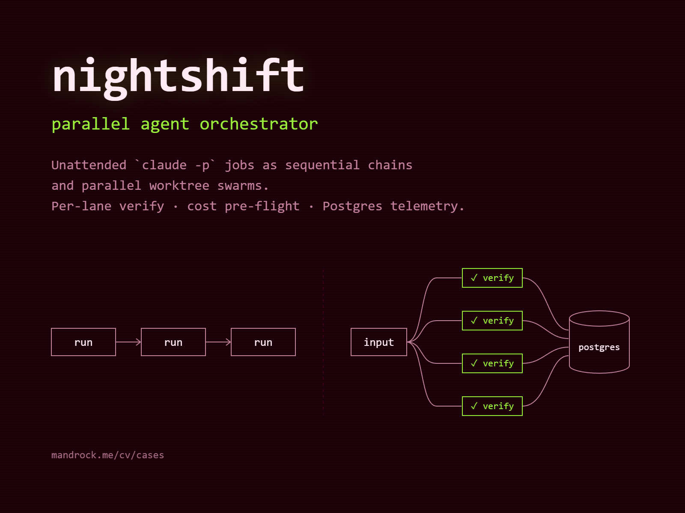

# nightshift



Headless driver layer for running Claude Code (and, as a second backend, Codex
CLI) unattended — single runs, dependent chains, and independent parallel
swarms — with the guardrails that make that safe to leave running overnight:
session-limit detection, a weekly budget lock, an expensive-model gate, a
mandatory output contract, machine-checkable verification per unit of work,
and Postgres-backed telemetry for cost and accuracy tracking. Independent
product (own git history, MIT-licensed), portable off a single VPS — every
state path (run directories, worktrees, DB credentials) is overridable via
env vars, with defaults that point at the maintainer's own node.

## Components

- **`bin/cc-run.sh`** — wrapper for a single run. `claude -p` (or, with
  `BACKEND=codex`, `codex exec`) against a run directory that already
  contains `task.md`; extracts `RESULT: ok|fail` from the tail of the log,
  fires a Telegram notification, records telemetry.
- **`bin/cc-chain.sh`** — sequential chain of dependent runs in one working
  copy. Each step continues the branch of the previous one; the chain stops
  at the first run that doesn't produce `RESULT: ok`.
- **`bin/cc-seq.sh`** — the chain's sibling for non-git working copies
  (`cc-chain.sh` requires a git repo).
- **`bin/cc-swarm.sh`** — swarm driver: N independent lanes, each in its own
  git worktree, run in parallel up to a concurrency ceiling, each gated by a
  mandatory `verify-cmd`, optionally reduced (fan-in) into one Sonnet run at
  the end. Does not reimplement spawning — it orchestrates `cc-run.sh`, the
  same binary single runs use.
- **`bin/cc-lane-local.sh`** — stub backend for a local quantized model
  (phase 2, currently always fails with exit 2 — a deliberate placeholder so
  `cc-swarm.sh` has something to call for `local:*` lanes without a later
  routing rewrite).
- **`bin/cc-estimate.sh`** — pre-flight cost/time estimate before spawning,
  based on the historical median of `swarm.runs` for the given model (seed
  values if history has fewer than 3 runs for that model). Explicitly does
  **not** scale by `task.md` size — that was tried and found not to
  correlate with actual token/time usage on real runs.
- **`bin/cc-cost.sh`** — post-flight cost from `usage.json`: total tokens,
  cache-read share, USD, and — for Opus runs — the Sonnet-equivalent cost
  (Sonnet is exactly 5x cheaper than Opus on every price component, so the
  equivalent is just `/5`).
- **`bin/run-usage.sh`** — finds the session JSONL transcript that was being
  written during a run and sums tokens per model into `usage.json`.
- **`bin/cc-telemetry.sh`** — best-effort UPSERT of one row into
  `swarm.runs` (or an INSERT into `swarm.verifications`) from a run
  directory's own files. Any failure (missing credentials, dead container,
  missing `docker`/`jq`) is logged and swallowed — telemetry never fails the
  run that triggered it.
- **`bin/cc-opus-gate.sh`** — the expensive-model gate (see below).
- **`bin/cc-week-guard.sh`** — the weekly budget lock (see below).
- **`bin/cc-notify.sh`** / **`bin/cc-notify-swarm.sh`** — best-effort
  Telegram notification, direct to the Bot API (not through a bot process),
  on two separate channels (single runs vs. swarm batches, so a swarm
  finishing doesn't spam the single-run channel).
- **`bin/cc-tg-format.sh`** — renders the `PREFLIGHT`/`FACT` blocks as
  Telegram-HTML for those notifications.
- **`bin/cc-gc.sh`** — retention for swarm branches/worktrees: removes
  `cc/<id>/<slug>` and `cc/<id>/fanin` branches older than a threshold
  (default 14 days), but only once they're merged into their fan-in branch
  or into `main` — anything not yet delivered gets a warning, not a delete.

## Gates

Every gate is a specific exit code, checked before or during a run so a bad
call fails fast and cheap rather than after burning tokens.

| Gate | What it catches | Exit code |
|---|---|---|
| Expensive-model gate (`cc-opus-gate.sh`) | Opus (or a Codex model mapped to Opus-tier: `gpt-6-sol`/`gpt-6-astra`) requested without `CC_OPUS_REASON` set — Opus costs 5x per token on every component, and 95%+ of a run's volume is cache-read of a growing transcript, so model choice is the main cost lever, not how tightly `task.md` is written | 6 |
| Weekly lock (`cc-week-guard.sh`, cron) | Weekly usage budget below threshold (`CC_WEEK_MIN_LEFT`, default 5%) — writes `.week-locked`, which every driver checks before spawning; self-healing, removes the lock once the week resets; fail-open if the usage number is unavailable | 5 |
| Session-limit detection | Claude/Codex quota exhausted mid-run — treated as "come back later", not a task failure; distinct code so retry logic and stats don't conflate it with a real failure | 3 |
| Isolation guard (`mkdir` lock) | A second run/chain spawned against a run directory (or CWD+plan, for chains) that's already in flight; stale lock (dead PID) is reclaimed automatically | 7 (`cc-run.sh`) / 4 (`cc-chain.sh`, isolation conflict) |
| Output contract / ambiguous exit | Process exits cleanly (RC 0) but the log has no `RESULT:` line — logged as `ambiguous`, not silently treated as ok or fail, with a `fail_reason` of `BG-WAIT` or `NO-RESULT` (see below) | 4 |

## Codex backend

`BACKEND=codex` on `cc-run.sh` (4th positional arg) or the 5th (chain) / 6th
(swarm) plan-file field runs `codex exec` instead of `claude -p`, using the
same `task.md` contract. Notable differences, documented in
`docs/codex-cli.md`:

- Claude-style model names (`opus`/`sonnet`/`haiku`) are mapped to Codex
  slugs (`gpt-6-sol`/`gpt-6-luna`/`gpt-6-luna`); `gpt-*` passes through
  as-is.
- Codex's `workspace-write` sandbox never gets write access to `.git`
  (`--add-dir .git` is deliberately forbidden — it would also grant write
  access to `.git/hooks/`, letting a hook execute code outside the sandbox).
  So the wrapper itself, in the parent process, commits any dirty tree after
  a `RESULT: ok` — `git add -A && git -c core.hooksPath=/dev/null commit`
  (`core.hooksPath=/dev/null`, not `--no-verify`, for the same reason
  `--add-dir .git` is off-limits). A failed commit flips the result to
  `RESULT: fail` with the git error in `NOTES`.
- Codex has no per-run token pricing ported yet — `cc-cost.sh`'s Codex path
  logs token counts and cache-read share only, cost shows as `n/a codex`.

## Exit codes

| Code | `cc-run.sh` | `cc-chain.sh` | `cc-swarm.sh` |
|---|---|---|---|
| 0 | ok | all runs passed | all lanes ok (+ fan-in ok) |
| 1 | missing `task.md` | — | invalid plan file |
| 2 | fail (no `RESULT: ok`) | a run failed | one or more lanes failed |
| 3 | session limit | session limit (Claude or Codex quota) | session limit |
| 4 | ambiguous (clean exit, no `RESULT:`) | isolation conflict (CWD/plan already in use) / ambiguous | — |
| 5 | weekly lock | weekly budget gate / weekly lock | weekly lock |
| 6 | expensive-model gate refusal | expensive-model gate refusal | — |
| 7 | run already in progress in this run-dir | — | — |

## Env vars

| Var | Default | Meaning |
|---|---|---|
| `CC_RUNS` | `$HOME/ops/cc-runs` | state directory: run-dirs, locks, logs |
| `CC_TOOLS` | `Bash Edit Write Read Glob Grep` | `--allowedTools` for `claude -p` |
| `CC_NOTIFY` | `<bin>/cc-notify.sh` | notification hook; missing file = silently skipped |
| `CC_TAG` | `run` | message prefix |
| `CC_CLAUDE_BIN` | `claude` | Claude CLI binary name/path |
| `CC_EXTRA_PATH` | (empty) | prefix added to `PATH` before spawn (nodes where `claude` sits outside non-interactive `sh`'s default `PATH`, e.g. WSL) |
| `CC_RUN_TIMEOUT_S` | `2700` | hard `timeout` ceiling per run/lane |
| `CC_WEEK_LOCK` | `$CC_RUNS/.week-locked` | weekly-lock sentinel file path |
| `CC_WEEK_MIN_LEFT` | `5` | weekly budget threshold (% left) below which the lock engages |
| `CC_OPUS_REASON` | (unset) | required, non-empty, to spawn an Opus-tier model |
| `CC_BACKEND` | `claude` | `claude`\|`codex`, default backend for plan lines without their own field |
| `CC_CODEX_BIN` | `codex` | Codex CLI binary |
| `CC_CODEX_SANDBOX` | `workspace-write` | `codex exec -s` |
| `MAXPAR` | `4` (swarm) | concurrency ceiling for lanes |
| `LANE_TIMEOUT` | `1800` | per-lane timeout (swarm); lane gets status `timeout`, does not block the rest |
| `DRYRUN` | `0` | validation/worktree/manifest only, no real spawn |
| `CC_RUNS_DIR` | alias for `CC_RUNS` | kept for backward compatibility |
| `CC_SWARMS_DIR` | `$CC_RUNS/../cc-swarms` | worktree/manifest directory |
| `CC_RUN_SH` | `$CC_RUNS_DIR/cc-run.sh` | single-lane runner (overridable in tests) |
| `CC_LANE_LOCAL_SH` | `$CC_RUNS_DIR/cc-lane-local.sh` | `local:*` lane runner |
| `CC_ESTIMATE_SH` | `$CC_RUNS_DIR/cc-estimate.sh` | pre-flight estimator |
| `CC_PG_CREDS` | `/root/ops/cc-runs/creds-pg.env` | file with `POSTGRES_PASSWORD=` (chmod 600, outside git) |
| `CC_PG_CONTAINER`/`CC_PG_DB`/`CC_PG_USER`/`CC_PG_HOST`/`CC_PG_PORT` | `mandrock-kb-postgres`/`mandrock_kb`/`mandrock`/`127.0.0.1`/`5432` | Postgres connection |

DB credentials are **never** hardcoded in scripts or committed — only in the
`CC_PG_CREDS` file, outside the repository. `.env.example` here is format
only.

## The `task.md` contract

Every run directory needs a `task.md` before `cc-run.sh` is invoked. Two
sections are appended automatically if the author forgot them (a driver
guarantee, not something callers need to remember):

- **Output contract** — the literal last line of the whole response must be
  exactly `RESULT: ok` or `RESULT: fail`, no asterisks, nothing after it.
  Everything above it can carry a human summary in whatever style is
  configured (see `style` below), but the contract line is always last —
  the parser matches it from the tail of the log.
- **Sync-only** — no `run_in_background`, `Monitor`, background pollers,
  background subagents, or `&` on a command whose result is awaited later.
  A headless `-p` run has no channel to receive a notification about a
  background job's completion — ending a turn "waiting for a monitor" exits
  the session with no `RESULT:` line, which the driver has to treat as
  ambiguous, not success. Waiting is allowed only synchronously, inside one
  Bash call, with an explicit limit.

`{RUN_ID}` in `task.md` is substituted with the real run id before spawn (in
both `cc-run.sh` and `cc-chain.sh`).

A clean exit (RC 0) with no `RESULT:` line in the log is **not** silently
scored either way — it's `ambiguous` (exit 4), with a `fail_reason` of
`BG-WAIT` (the tail of the log mentions background/monitor/polling — likely
a Sync-only violation) or `NO-RESULT` (the agent just forgot the contract
line).

## Quick start

**Single run:**

```sh
mkdir -p /path/to/run-dir
cp task.md /path/to/run-dir/task.md
sh bin/cc-run.sh /path/to/run-dir none sonnet
```

**Chain** (sequential, dependent steps, one working copy, git required):

```sh
sh bin/cc-chain.sh <repo> <plan-file> [tag]
```

Plan file, one line per step: `slug|style|/abs/path/task.md|model|backend`.

**Swarm** (independent lanes, own worktree each, parallel):

```sh
sh bin/cc-swarm.sh <repo> <swarm-plan> <swarm-id>
```

Plan file, one line per lane: `lane-slug|task.md|verify-cmd|model|style|backend`.
`verify-cmd` is mandatory — it runs inside the lane's worktree after the run
and its exit code (0 = ok) is what the swarm actually trusts, not the
model's own `RESULT:` claim. Optional fan-in: `<swarm-plan>.fanin`, a
`task.md` for reducing all lanes, run on `cc/<swarm-id>/fanin`, always
Sonnet.

Pre-flight estimate before either driver, or standalone:

```sh
sh bin/cc-estimate.sh --task task.md --model sonnet [--lanes N] [--maxpar K] [--run-id ID]
```

## Telemetry

Schema `swarm` in Postgres (`sql/001_swarm_schema.sql`, idempotent):

- **`swarm.runs`** — one row per unit of execution (`run`/`chain`/`swarm`/
  `lane`/`fanin`), tokens/duration/status/`parent_run_id`, plus (from
  `002_escalation.sql`) `escalation_of`/`attempt` for retries that escalate
  to a different model.
- **`swarm.verifications`** — log of `verify-cmd` results per lane.
- **`swarm.estimates`** — the pre-flight prediction (`cc-estimate.sh`) plus
  the post-flight actual (`cc-telemetry.sh` fills in `actual_*`) — an
  `error_pct` generated column calibrates the estimator against its own
  history.
- **`swarm.routes`** — the swarm-vs-chain-vs-hybrid routing decision, kept
  for audit.

`run_id` on `estimates`/`routes`/`verifications` is deliberately **not** a
foreign key on `runs` — both are written before the run itself exists.

Apply the schema:

```sh
docker exec -i -e PGPASSWORD="$(cut -d= -f2- < /root/ops/cc-runs/creds-pg.env)" \
  mandrock-kb-postgres psql -h 127.0.0.1 -U mandrock -d mandrock_kb < sql/001_swarm_schema.sql
```

## Tests

```sh
sh tests/run-all.sh
```

Covers, among others: real `MAXPAR` ceiling under `dash` (`wait -n` is not
POSIX), session-limit stop via sentinel file, timeout kill of a hung lane,
duplicate-run guard, escalation cap, Codex-backend chain continuity,
`{RUN_ID}` substitution, notify isolation (tests never hit the real
Telegram API), and the Sync-only/verify denylist. All tests are isolated
(`mktemp -d`, stub `CC_RUN_SH`, a separate `CC_PG_CREDS` pointing at no
credentials) — none touch production state or the production database.

## License

MIT.
